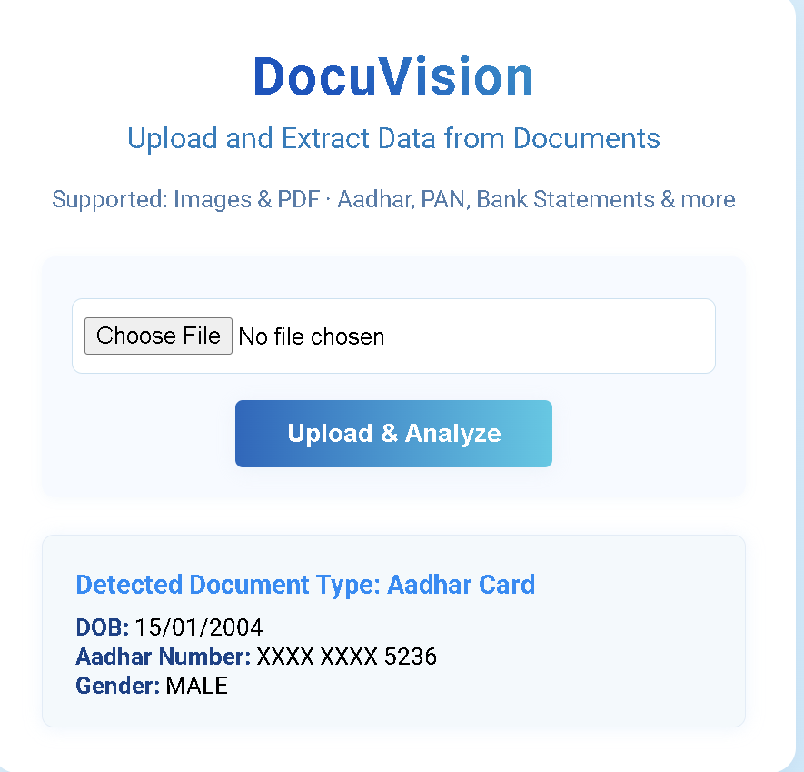

# DocuVision: Intelligent Document Classifier & Data Extraction

**DocuVision** is a web-based tool for uploading common Indian financial/identity documents (such as Aadhar, PAN, and bank statements) as images or PDFs. It auto-detects the document type and extracts key fields into a structured, easy-to-read format—masking sensitive information when appropriate.

---

## Business/User Summary (Non-Technical Reviewers)

**Purpose:**  
Helps admin teams easily collect, check, and record important document information without manual copy-paste or reading errors.

**How it works:**  
- User uploads a scanned document (photo or PDF) via a website.
- The system automatically:
    - Recognizes the type of document (Aadhar, PAN, Bank Statement, etc).
    - Extracts important details (like name, birthdate, document number, address).
    - Hides (masks) part of sensitive numbers (e.g., Aadhar number appears as `XXXX XXXX 1234`).
    - Shows details in a friendly, readable format on the website—no need for an expert!
- No data is stored—all information is processed only in memory and shown on the current webpage.

**Benefits:**
- No manual reading or typing from documents.
- Fewer mistakes and more consistency.
- Candidate information stays private (sensitive numbers masked, no data is saved).
- Works with scans or photos in common formats.

---

## Demo


## Technical Approach

**How it works (Behind the scenes):**
1. **Document Upload:**  
   User uploads an image (.jpg, .png) or PDF.

2. **OCR Extraction:**  
   The system uses Tesseract OCR to "read" text from the document.  
   PDFs are converted page-by-page to images first.

3. **Document Type Classification:**  
   The extracted text is scanned for patterns (like "UIDAI", "Income Tax", or a PAN pattern e.g., `ABCDE1234F`) using keyword and regex matching.

4. **Data Extraction & Masking:**  
   - The app uses regular expressions and keywords to find key data (like Name, DOB, document numbers).
   - Sensitive values (like Aadhar and account numbers) are automatically masked in the results.

5. **Result Display:**  
   All extracted data, including field masking where necessary, is shown on the web interface in a user-friendly, field-by-field format.

---

## Getting Started (Technical Setup)

**Requirements:**
- Python 3.7+
- [Tesseract OCR](https://github.com/UB-Mannheim/tesseract/wiki) (must be installed and added to your system PATH)
- [Poppler for Windows](https://github.com/oschwartz10612/poppler-windows/releases/) (required for PDF support; add its `bin` directory to PATH)

**Python Dependencies:**
```
Flask
pytesseract
pdf2image
Pillow
```
Install them running:
```bash
pip install -r requirements.txt
```

**Run the App:**
```bash
python app.py
```
Open [http://127.0.0.1:5000/](http://127.0.0.1:5000/) in your browser.

---

## Folder Structure

```
your_project/
│ app.py
│ requirements.txt
└─ templates/
     upload.html
```

---

## Notes for HR/Admin

- **No data is stored:** What you upload is only processed for this session.
- **Masking by default:** Aadhar and bank account numbers are always hidden except their last digits.
- **Errors:** If the document is not clear or not supported, the app will tell you.

---

## Future Extensions (For Technical Team)

- Add other document types or regional languages
- Integrate with HR database or APIs if needed
- Deploy on secure company intranet for privacy

---

## FAQ

- **Q: What file types are supported?**  
  Images (`.jpg`, `.jpeg`, `.png`) and PDFs.
- **Q: Can I use a phone photo?**  
  Yes, as long as the image is clear and the text is legible.

